# Upwork Jobs Scraper  || RPA Robot with UiPath

## Process Short Description
● Extract freelancing jobs details from Upwork in one specific specialization.

● Filter the extracted jobs based on the number of proposals, and payment verification status.

## Workflows Screenshots

### Main Workflow
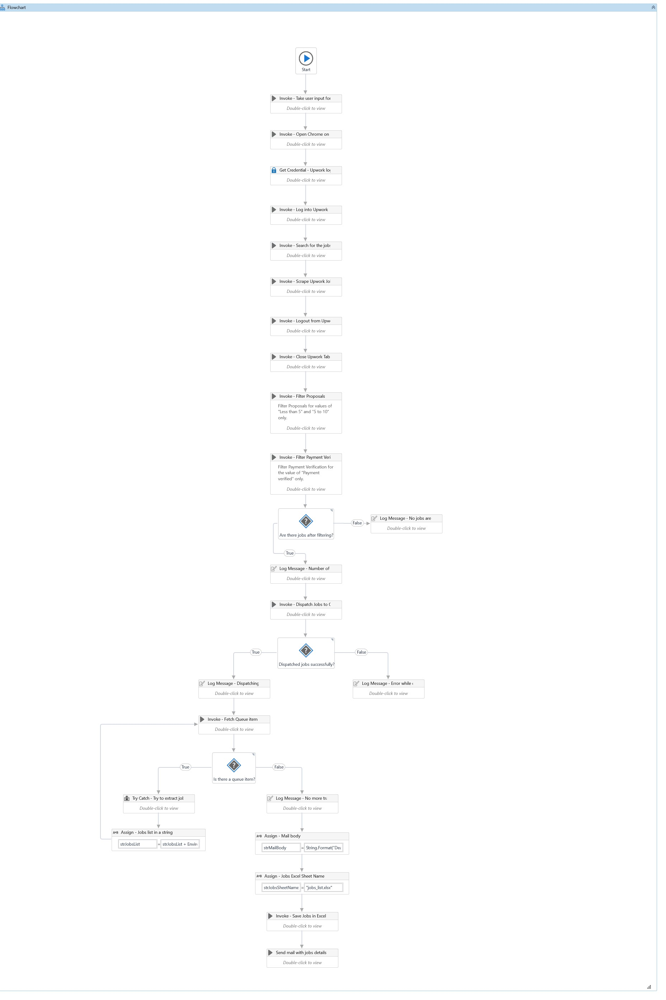

### Generic_CloseChromeTab Workflow
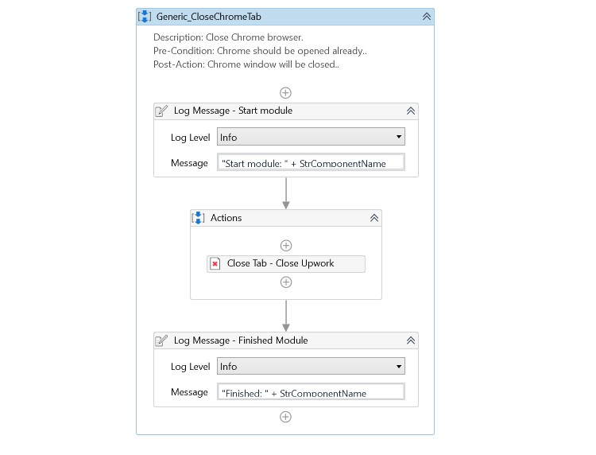

### Generic_FilterDataTable Workflow
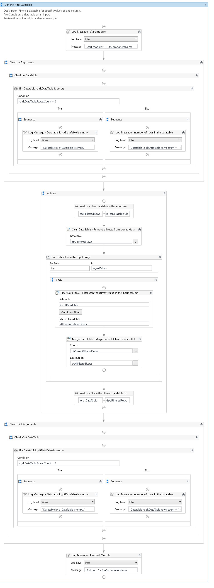

### Generic_OpenChromeTab Workflow
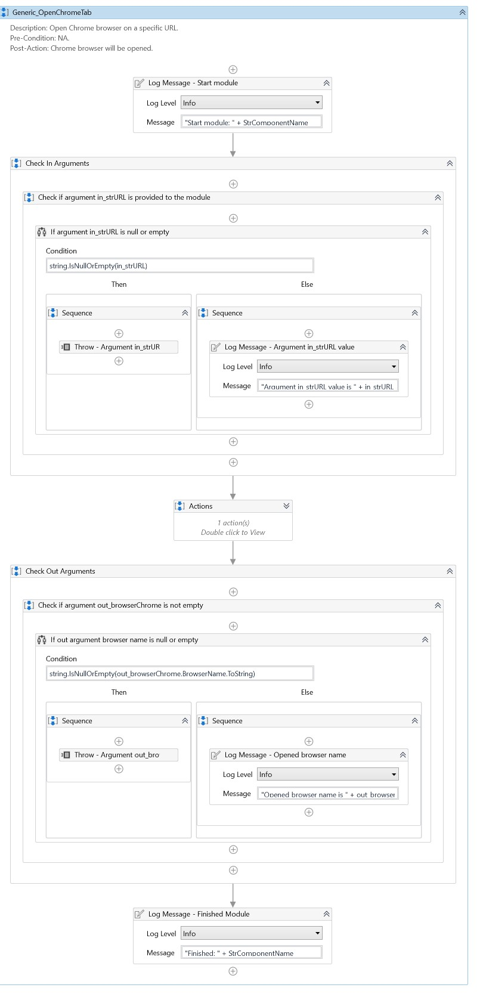

### Generic_QueueDispatcher Workflow
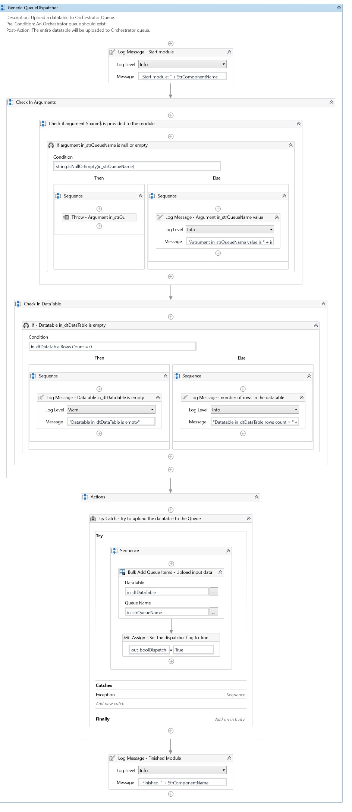

### Generic_QueuePerformer Workflow
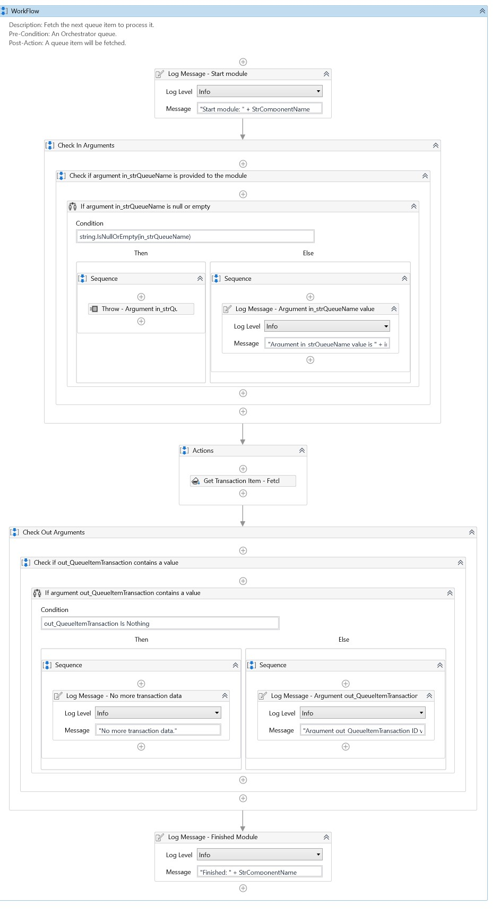

### Generic_SaveDataTable Workflow
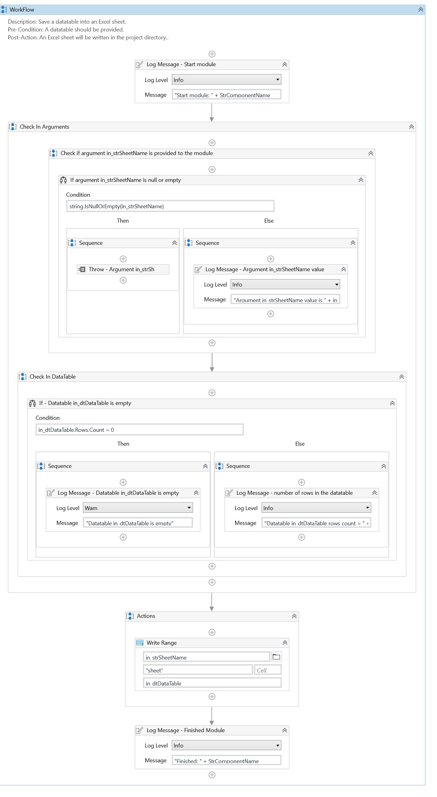

### Generic_TakeUserInput Workflow
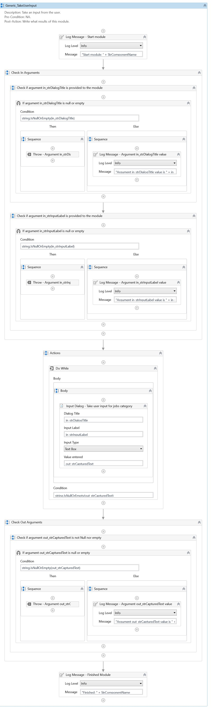

### Outlook_SendMail Workflow
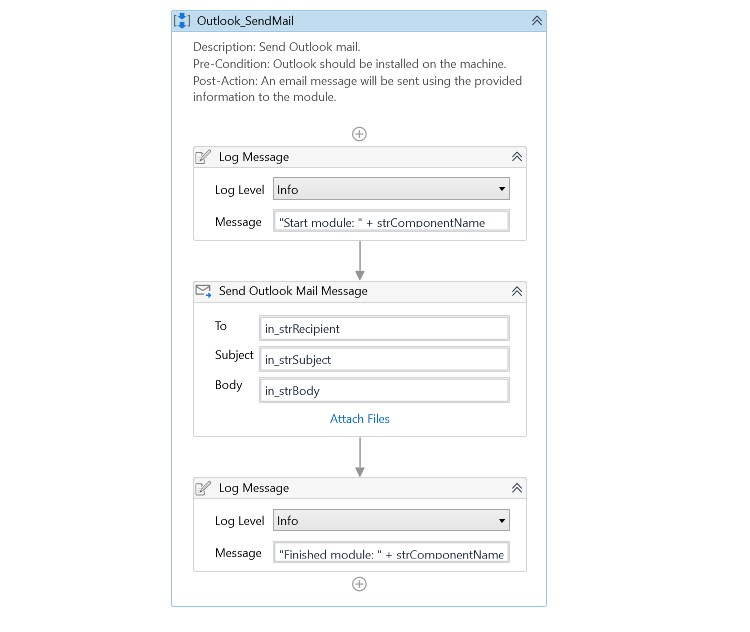

### Upwork_Login Workflow
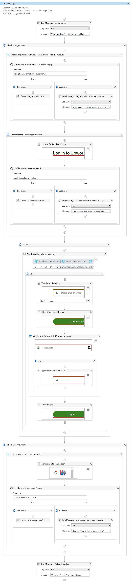

### Upwork_Logout Workflow
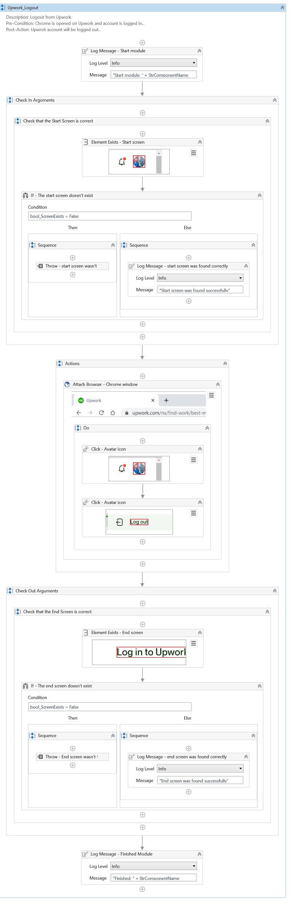

### Upwork_ScrapeJobs Workflow
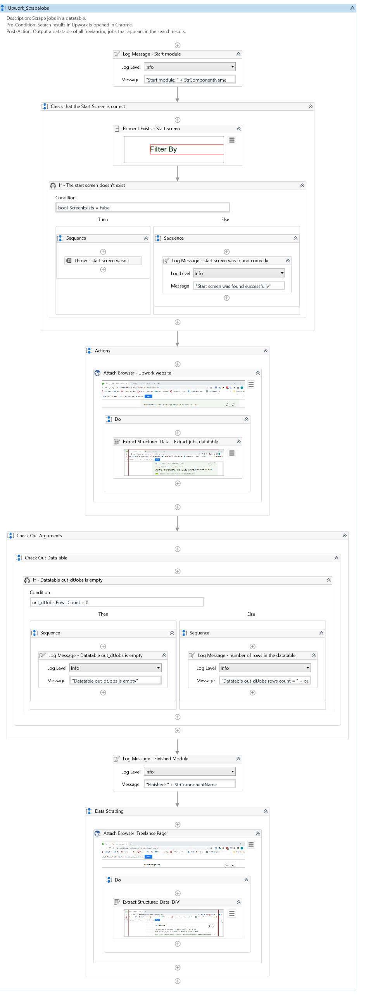

## About The Author

* Author: Mohamed Abdel-Gawad Ibrahim
* Contact: muhammadabdelgawwad@gmail.com
* Phone: +201069052620 || +201147821232