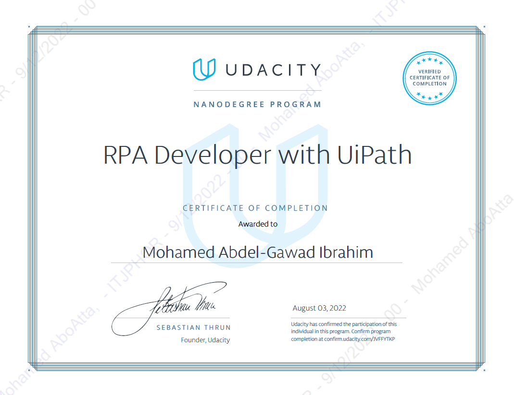

# Upwork Jobs Scraper  || RPA Robot with UiPath

## Process Short Description
An attended robot that takes input from the user that represents their specialization. After that, it opens Upwork, and logs into their account, using their credentials that are saved in a credential asset in the Orchestrator. then, it searches for the opening jobs in the required specialization, scrapes the results, and filter them based on the number of proposals, and payment verification status. Finally, send the filtered results by mail to the attended user.

## Certification

This project was a milestone in my journey to study the RPA Developer With UiPath Nanodegree provided by Udacity.

## Workflows Screenshots

### Main Workflow

### Generic_CloseChromeTab Workflow

### Generic_FilterDataTable Workflow

### Generic_OpenChromeTab Workflow

### Generic_QueueDispatcher Workflow

### Generic_QueuePerformer Workflow

### Generic_SaveDataTable Workflow

### Generic_TakeUserInput Workflow

### Outlook_SendMail Workflow

### Upwork_Login Workflow

### Upwork_Logout Workflow

### Upwork_ScrapeJobs Workflow

## About The Author

* Author: Mohamed Abdel-Gawad Ibrahim
* Contact: muhammadabdelgawwad@gmail.com
* Phone: +201069052620 || +201147821232
